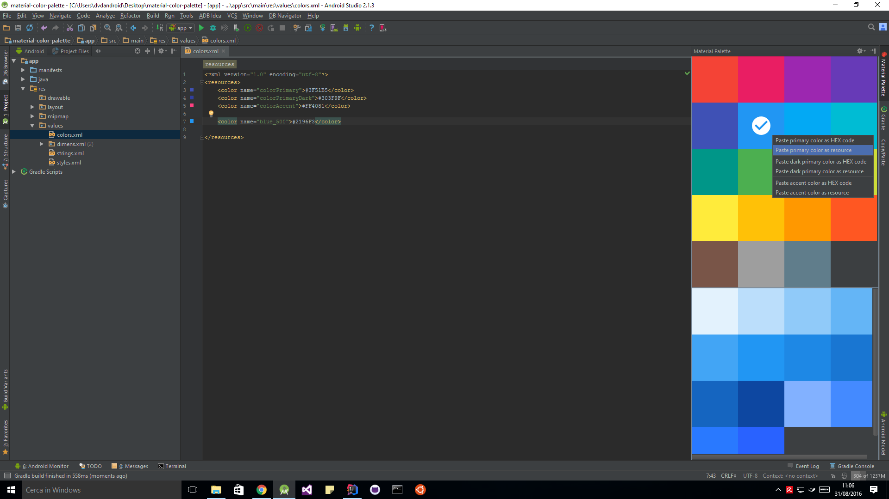
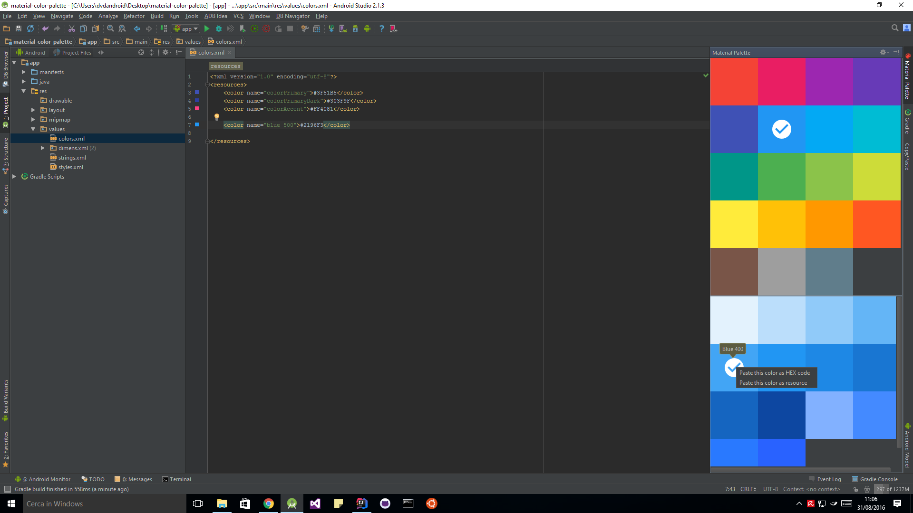

material-color-palette-plugin
=============================

This plugin helps you add a Material Color value into the project

[JetBrains Plugin Repository](https://plugins.jetbrains.com/plugin/8590)

## Screenshots

## Compatibility

- All JetBrains IDEs 2019.1+
- Android Studio 3.5+

## Installation

- <kbd>Preferences</kbd> > <kbd>Plugins</kbd> > <kbd>Browse repositories...</kbd> > <kbd>Search for "Material Color Palette"</kbd> > <kbd>Install Plugin</kbd>
- Restart IDE (if your IDE doesn't support dynamic plugins)
